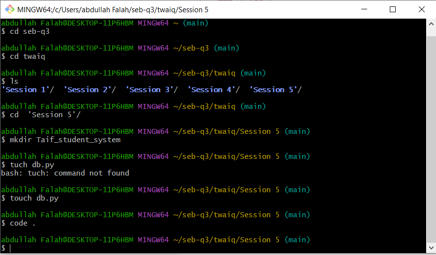
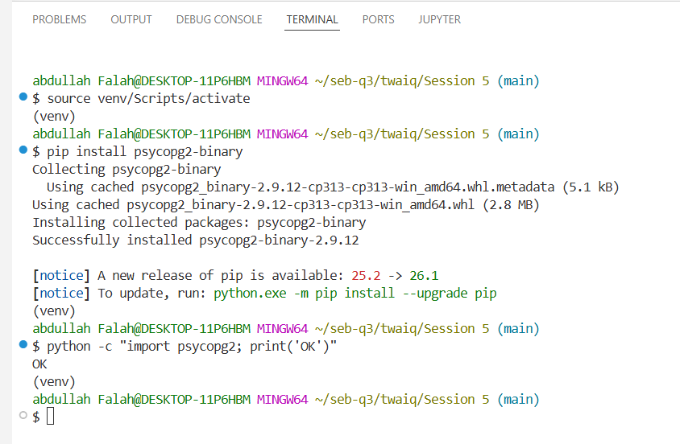

### 📘 Student Course Management System

---
#### Tables
1. Students 
2. Courses 
3. Instructors 
4. Enrollments 
---

#### 🛠️ Virtual Environment Setup

🔰 Install Libraries :

```bash
pip install psycopg2-binary
```

```bash
python -m venv venv
```

####  🟢 Create PROJECT :



#### 🟡 Environment Setup :


---
